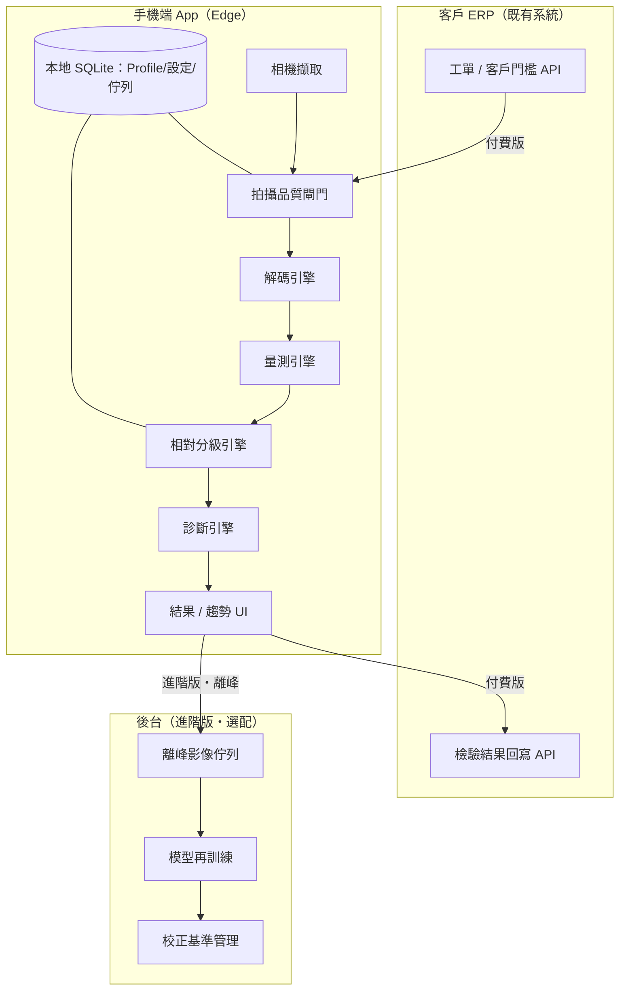
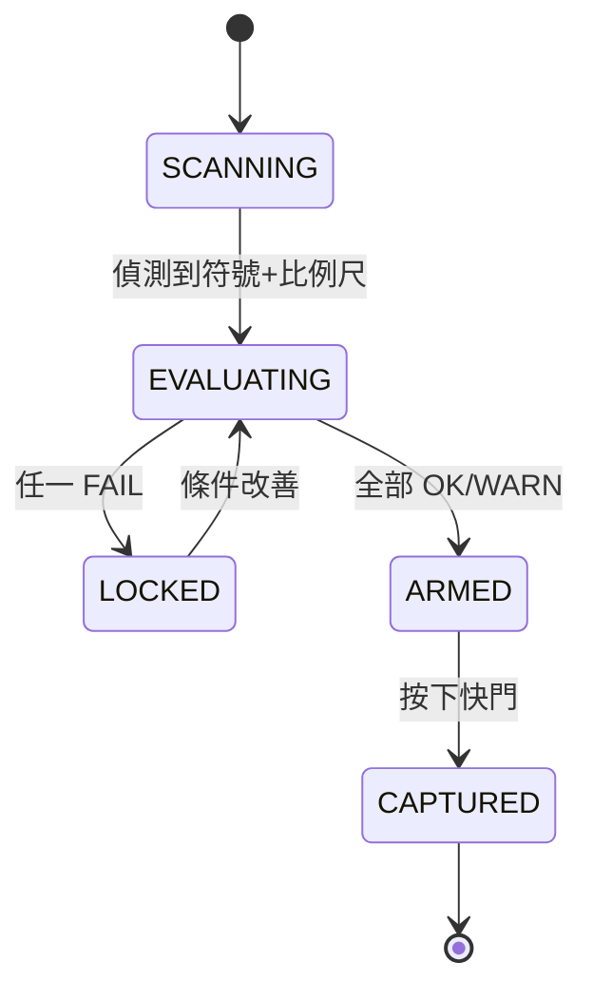

# 瓦楞箱條碼 / QR Code 品質檢驗 App — 完整文件（單一主檔）v1

> 本檔涵蓋全部內容：商業規劃 + 互動原型說明 + 系統/開發規格 + 共用參考資料 + 決策紀錄。
> 唯一配套外檔：`條碼品質檢驗_原型_v2_瓦楞廠.html`（可實際點擊的三畫面 demo；其畫面與互動已於 Part B 完整文字化）。

| 項目 | 內容 |
|---|---|
| 產品 | 手機相對品質篩檢 App（ERP 加值檢驗模組） |
| 場域 | 瓦楞紙板紙箱廠（柔印直印 / 表貼 / 物流標籤） |
| 定位 | **相對品質篩檢 + 趨勢監控，非 ISO 合規驗證** |
| 符號 | ITF-14（箱面直印）、GS1-128（標籤）、QR / DataMatrix（溯源・自動倉） |
| 商業 | ERP 廠商：免費版單機快篩，付費版直連 API / 回寫 ERP |
| 版本 | v1 · 2026-06 · 撰擬 Lin（行銷業務 × 美術設計） |

---

## 全文目錄

**Part A — 商業規劃**　A1 背景痛點 · A2 定位與成功定義 · A3 範圍護欄 · A4 可行性論證 · A5 版本分層與商業模式 · A6 MVP 分期

**Part B — 互動原型說明**　B1 設計語言 · B2 畫面一：拍攝 · B3 畫面二：結果 · B4 畫面三：趨勢 · B5 畫面↔規格對應

**Part C — 系統 / 開發規格（SDD）**　C1 架構 · C2 技術選型 · C3 資料模型 · C4 拍攝閘門 · C5 解碼 · C6 量測 · C7 分級 · C8 診斷 · C9 ERP API · C10 版本旗標/NFR · C11 測試 · C12 Backlog

**Part D — 共用參考資料**　D1 ISO 參數 · D2 ITF-14 規格 · D3 楞型/楞距 · D4 基準物 · D5 名詞表 · D6 資料來源

**Part E — 決策紀錄（跨議程）**

---
---

# Part A — 商業規劃

## A1 背景與痛點

自動倉儲與大型品牌客戶對外箱條碼的要求逐年收緊。過去「掃得到就好」，如今驗收看 ISO 等級：ITF-14、GS1-128 常被要求 C 級（1.5）以上，部分高速分揀線要 B 級。不達標輕則退貨重印、重則 charge-back 罰款，直接侵蝕紙箱廠利潤。

瓦楞箱有先天劣勢：**直接柔印在牛皮瓦楞上，等級天生難看。** 三因疊加——牛皮吃光（反射低）、柔版墨擴張造成條寬增益（bar width gain）、楞痕／搓衣板效應（washboarding）造成對齊楞距的週期明暗起伏——常把本可 A 級壓到 C/D。痛點在於：通常要等客戶端掃不過、退貨回來才知道。

**本案核心：** 把「事後才發現」的風險前移到柔印機邊與出貨前，用一支手機做相對篩檢與趨勢監控攔下來。

## A2 產品定位與成功定義

- **一句話定位：** 手機端「相對品質篩檢 + 趨勢監控」工具，不是合規驗證儀。
- **使用情境：** 柔印機邊即時抽檢、出貨前批次自檢、客訴退貨複驗。
- **商業定位：** ERP 廠商加值模組——免費版養現場習慣，付費版以 API 直連回寫 ERP 收費並提高黏著。

**成功定義（驗收主軸）：**
- **可重複性（repeatability）為王**：同張條碼、不同人/時間拍，相對等級要穩定一致——趨勢監控的根本。
- **解碼可靠度**：常見 symbology 的 decode 成功率與一致性。
- **預警提前性**：在等級掉到「不可讀」前，提前示警柔印參數惡化。
- **商業面**：免費版留存率、付費版 ERP 串接轉換率。

## A3 範圍護欄（明確不做）

本工具**一律不出具 ISO 合規證書，不取代合規 verifier**。App 內等級一律標「參考等級／相對值」。合規驗證需求引導客戶改用具固定照明幾何（角度、孔徑、波長）的合規驗證機。此界線須寫進 UI 與對外文案。

## A4 可行性與精度論證

**A4.1 命門：能解碼 ≠ 能評級。** decode 是最低門檻；grading 要依 ISO/IEC 15416（1D）、15415（2D）量一整組光學參數再換算等級。

**A4.2 照明幾何限制 → 只做相對篩檢。** 合規分級要固定入射角（常 45°）、特定孔徑、特定波長（常 660nm）。手機白光 LED + 任意角度做不到合規，故誠實定位相對篩檢。

**A4.3 解析度需求。** 條碼對局部清晰度要求高、但符號面積小，總像素需求不大；挑戰是「局部夠銳、不晃、照明穩」。
- 每模組 / X-dimension 至少 **5–10 px** 才能穩定相對分級。
- ITF-14 直印 100%（X≈1.016mm）需 GSD 約 **0.10–0.20mm/px**，近代手機 15–20cm 可達。
- 真正殺手：手震/動態模糊、亮面上光/覆膜眩光 → 由閘門把關。

**A4.4 參數穩定度分類（手機可信度）** — 準度策略核心：

| 類別 | 代表參數 | 手機可信度 | 策略 |
|---|---|---|---|
| 幾何類 | Decodability、Defects、FPD、Axial/Grid 不均、X 寬、Quiet Zone | 高（不太吃光線） | 直接採信，作相對等級主幹 |
| 光線類 | Symbol Contrast、Modulation、Min Reflectance | 中（受光線影響） | 參考卡黑白塊正規化後，標相對值 |

> 2D/QR 最能反映印刷崩壞的「FPD、網格不均」屬幾何類，手機相對篩檢可靠；怕光的對比/調變度靠黑白參考塊壓住。

**A4.5 比例尺必要性。** 條碼品質必量 X-dimension 與 Quiet Zone；無實體基準則只有像素、量不出 mm，也算不出 BWR。**故基準物為必要、非選配**（首選平面參考卡，硬幣備援）。

**A4.6 可重複性如何達成。** 拍攝品質閘門強制每次條件一致（焦/角度/白平衡/比例尺/楞痕），全綠放行；選配遮光治具進一步鎖環境光與距離。

## A5 版本分層與商業模式

- **免費版（誘餌）：** 拍照→decode→相對燈號 + 基本參數；完整閘門保留；單機、不留存、不串接。目的：佔現場、養依賴。
- **付費版：** 完整參數報告 + 量測（需參考卡）+ 印刷掉級診斷 + 選製程 + 工法/楞型基準檔 + CSV + **API 直連/回寫 ERP（殺手鐧）** + 趨勢儀表板。
- **進階/Server（可選）：** 跨線/跨廠學習、離峰上傳優化模型、校正基準管理、預警推播。

**綁定邏輯：** 檢驗資料回寫 ERP 後與工單/客戶/製程打通形成黏著——ERP 廠商收費與留客的核心槓桿。能力對照見 [C10](#c10-版本旗標--非功能需求)。

## A6 MVP 分期

| 階段 | 目標 | 內容 |
|---|---|---|
| P0 | 免費骨幹 | ITF-14 decode + 相對燈號 + 拍攝品質閘門（瓦楞變數） |
| P1 | 付費核心 | 完整參數 + 量測（參考卡）+ 印刷掉級診斷 + CSV |
| P2 | ERP 串接 | 工單帶門檻、結果回寫、趨勢監控 + 工法/楞型基準檔 |
| P3 | 擴充 | GS1-128 / QR / DataMatrix 全支援、Server 學習與校正 |

**原則：** P0 先佔現場、驗可重複性；P1–P2 做厚付費價值；P3 橫向擴符號與後台智能。細部 Backlog 見 [C12](#c12-backlog勾選清單)。

---
---

# Part B — 互動原型說明

> 對應外檔 `條碼品質檢驗_原型_v2_瓦楞廠.html`。本節把原型的畫面、互動與設計意圖完整文字化，不開檔也能理解。

## B1 設計語言

定位為**現場檢測儀器**而非消費 App：

- **觀景窗深色 HUD**：拍攝畫面是機器視覺風格的深色觀景窗 + 校準框 + 掃描光束。
- **儀表讀數**：數據畫面採白底儀表面板，等級與參數一律用**等寬字**呈現，像量測儀面板。
- **分級燈號配色**：直接借條碼分級的綠（A/通過）→ 琥珀（C/警示）→ 紅（D-F/退）語言。
- **色盲友善**：等級永遠「字母 + 顏色」並陳，不單靠顏色判讀。

## B2 畫面一：拍攝（機器視覺 HUD）

**版面：** 深色觀景窗中央為校準框與掃描光束，框內預設顯示帶 **bearer bar（保護框）** 的 ITF-14（牛皮底色，一眼可辨直印瓦楞）。底部顯示「比例尺卡 已偵測 · 基準 26.0mm」。

**頂部三 chip（可點切換）：** 製程環節（產線抽檢／出貨檢驗／客訴複驗）、工法/楞型（直印C楞／直印E楞／表貼平印）、符號別（ITF-14·直印 → GS1-128·標籤 → QR/DM·溯源 輪換）。

**六項品質燈號（即時亮起）：** 對焦、眩光、楞痕透印、白平衡、比例尺卡、印向直立。

**互動／示範重點：**
- 進入後自動跑校準，六燈號逐一亮起；**全綠前快門鎖死**（灰、未就緒），全綠才變青色「可拍」——具體演示「穩 > 準」：強制每次拍攝條件一致，趨勢才有意義。
- 「楞痕透印」刻意跳**黃燈**，示範黃燈仍可拍但數值會標「受楞痕影響」——相對篩檢的容忍度與合規驗證不同。
- 點「符號」chip 會切換觀景窗符號，並連動結果頁的參數集、量測與診斷。

## B3 畫面二：結果（儀表讀數）

- **解碼列：** 綠勾「解碼成功」+ 符號別 + 尺寸 + 解碼字串（等寬字）。
- **參考等級大圈：** 圓環顏色對應等級，圈內大字母 + 「參考等級」；底下紅字寫死「**相對值・非 ISO 合規證書**」——法律護欄。
- **門檻判定：** 顯示「客戶接受門檻 ≥ C」與 pass/fail（如 B≥C → 通過）；含 A–F 等級條，當前等級高亮。
- **分級參數列：** 每項左側等級字母色塊 + 名稱 + 比例條 + 右側標籤「**幾何·穩**」（綠）或「**光線·相對**」（琥珀）。
- **尺寸量測（以比例尺卡）：** 四格——X-dimension、條寬增益 BWR、Quiet Zone、楞痕週期（對齊楞距）；各格標規格達標與否。
- **印刷掉級診斷卡（琥珀）：** 點名病因 + 處方（依 severity）。切到 1D 會變「柔印墨量過多→條寬增益」那套；切 QR 變「套印/基材伸縮」。
- **動作鈕：** 重拍 / 標記製程 / 存成 CSV（付費版）。
- **頁尾護欄：** 「篩檢結果為相對值…法規驗證請用合規 verifier；本工具不出具 ISO 證書。」

## B4 畫面三：趨勢（進階版）

- **製程環節分頁：** 產線抽檢 / 出貨檢驗 / 客訴複驗。
- **工法/楞型基準檔分頁：** 直印粗楞ABC / 直印細楞EF / 表貼平印——**切換時曲線與門檻線一起跳動**：粗楞貼著門檻跑、細楞抬高、表貼穩在 A，視覺化「楞越粗、楞痕越兇、越易掉級」，並支撐「高階訂單導向細楞/表貼」的業務話術。
- **統計列：** 平均參考等級、趨近門檻批次比例、近 3 批走勢箭頭。
- **趨勢圖：** 近 10 批參考等級折線 + 紅色門檻虛線；趨近門檻的點以紅圈**預警**（在掉到不可讀前示警）。
- 右上「進階版 · 需後台」標記。

## B5 畫面 ↔ 規格對應

| 畫面元素 | 對應規格 / 資料欄位 |
|---|---|
| 六項品質燈號 | [C4](#c4-擷取與拍攝品質閘門) GateCheck |
| 參考等級大圈 + 非合規標註 | [C7](#c7-相對分級引擎) GradeResult（`isRelative=true`） |
| 門檻 pass/fail | AcceptancePolicy / AcceptanceEvaluation |
| 參數列「幾何/光線」標籤 | ParameterGrade.kind |
| 尺寸量測四格 | [C6](#c6-量測引擎) Measurement |
| 印刷掉級診斷卡 | [C8](#c8-診斷引擎) DiagnosisRule |
| 工法/楞型分頁 | SubstrateProfile（各自門檻） |
| 存 CSV / 趨勢 | [C9](#c9-erp--api-串接付費版) 版本旗標 |

---
---

# Part C — 系統 / 開發規格（SDD）

> 落到可實作粒度。門檻標 `〔可調〕` 者為起始值，須以黃金樣本校正後鎖定。UI 規格見 Part B。

## C1 系統架構



| 層 | 職責 | 版本 |
|---|---|---|
| Edge（裝置） | 即時閘門、解碼、量測、分級、診斷、UI、離線佇列 | 全版本 |
| ERP 串接 | 工單帶門檻、結果回寫、CSV | 付費版 |
| Server | 影像學習、再訓練、校正基準、預警推播 | 進階版 |

**原則：** 即時品質判斷一律在裝置端（離線可用）；網路只做同步與離峰學習。

## C2 技術選型（假設・可替換）

| 層 | 建議 | 替代 |
|---|---|---|
| App 框架 | **Flutter (Dart)** 跨平台 | React Native、原生 Swift/Kotlin |
| 相機 | iOS AVFoundation / Android CameraX（platform channel） | — |
| 影像處理 | **OpenCV**（FFI / opencv_dart） | 原生 Vision / MLKit |
| 1D 解碼 | **ZXing-C++** / ZBar | 商用 Scandit / Dynamsoft（難件） |
| 2D 解碼 | **ZXing**（QR）+ **libdmtx**（DataMatrix） | 商用 SDK |
| 本地儲存 | SQLite（drift / sqflite） | Realm |
| 後台 | **Python FastAPI + PostgreSQL + S3 相容物件儲存** | Node/Nest |
| ERP 串接 | REST / JSON over HTTPS（OAuth2 或 API Key） | 依客戶 ERP |

**相機最低要求：** 後鏡頭 ≥12MP（4032×3024），支援 AE/AF/AWB lock——鎖定能力是可重複性硬需求；無法鎖定者降級「僅解碼」模式。

## C3 領域模型（資料結構）

### C3.1 核心實體

```typescript
type Symbology = 'ITF14' | 'GS1_128' | 'CODE128' | 'QR' | 'DATAMATRIX';
type GradeLetter = 'A' | 'B' | 'C' | 'D' | 'F';
type GateStatus = 'OK' | 'WARN' | 'FAIL';
type Tier = 'FREE' | 'PAID' | 'ADVANCED';
type ProcessStage = 'INLINE' | 'OUTBOUND' | 'COMPLAINT'; // 產線抽檢/出貨檢驗/客訴複驗

interface InspectionSession {
  id: string; createdAt: string; operatorId?: string;
  plantId?: string; lineId?: string;
  processStage: ProcessStage;
  workOrderId?: string;            // ERP（付費版）
  substrateProfileId: string;
  symbology: Symbology;
  capture: CaptureQualityReport;
  decode: DecodeResult;
  measurement?: Measurement;       // 需比例尺
  grade: GradeResult;
  diagnosis: DiagnosisResult;
  acceptance: AcceptanceEvaluation;
  imageRef?: string;
  syncState: 'LOCAL' | 'QUEUED' | 'SYNCED' | 'FAILED';
}

interface CaptureQualityReport {
  passedAll: boolean; gsdMmPerPx: number; pxPerModule: number;
  checks: GateCheck[];
}
interface GateCheck { key: string; status: GateStatus; value: number; threshold: string; }

interface DecodeResult {
  decoded: boolean; symbology: Symbology; data?: string;
  dimension?: string; expectedDataMatch?: boolean;
}

interface Measurement {
  scaleRef: ScaleReference;
  xDimMm: number; barWidthGainMm?: number; quietZoneX: number;
  moduleSizeMm?: number;
  washboard?: { detected: boolean; periodMm: number; amplitudeRatio: number };
}
interface ScaleReference { type: 'CARD' | 'COIN'; nominalMm: number; resolvedPx: number }

interface GradeResult {
  overall: GradeLetter; overallScore: number; isRelative: true;
  parameters: ParameterGrade[];
}
interface ParameterGrade {
  code: string; label: string; letter: GradeLetter; score: number;
  kind: 'GEOMETRIC' | 'PHOTOMETRIC';
}

interface AcceptanceEvaluation {
  policyId: string; requiredGrade: GradeLetter; pass: boolean; marginScore: number;
}
interface DiagnosisResult { matched: DiagnosisHit[] }
interface DiagnosisHit { ruleId: string; cause: string; remedy: string; severity: 1|2|3 }
```

### C3.2 設定與基準檔

```typescript
interface SubstrateProfile {
  id: string; name: string;
  category: 'DIRECT_COARSE' | 'DIRECT_FINE' | 'LITHO_LAM' | 'LABEL';
  fluteType?: 'A'|'B'|'C'|'E'|'F'|'NONE';
  expectedFlutePitchMm?: number;   // washboard 比對（D3）
  baseline: { meanScore: number; stdScore: number; sampleN: number };
  thresholds: { alertScore: number };  // 各 profile 獨立
}

interface AcceptancePolicy {
  id: string; customer?: string; symbology: Symbology;
  requiredGrade: GradeLetter;      // ITF-14 常 ≥C；GS1-128 ≥B
  xDimSpecMm: number;              // ITF-14 100% = 1.016
  quietZoneMinX: number;           // ITF-14 ≈10
  apertureMil?: number;
}

interface AppSettings {
  defaultProcessStage: ProcessStage;
  scaleRefDefault: ScaleReference;
  tier: Tier; erp?: ErpConnection; language: 'zh-Hant' | 'en';
}
```

### C3.3 診斷規則（資料驅動）

```typescript
interface DiagnosisRule {
  id: string; appliesTo: Symbology[];
  substrateCategories?: SubstrateProfile['category'][];
  when: RuleCondition[];           // AND
  cause: string; remedy: string; severity: 1|2|3;
}
interface RuleCondition { metric: string; op: '<'|'>'|'<='|'>='|'=='; value: number }
```

## C4 擷取與拍攝品質閘門

**六項全綠才解鎖快門**（WARN 可拍但標註，FAIL 鎖定）。門檻 `〔可調〕`，並隨 SubstrateProfile 微調。

### C4.1 狀態機



### C4.2 六項檢查

| key | 量測方法 | 數值 | OK | WARN | FAIL |
|---|---|---|---|---|---|
| `focus` | Laplacian 變異數（ROI，正規化 8-bit） | varLap | ≥120 | — | <120 |
| `glare` | 高光占比（L>250 像素比例） | % | ≤1% | 1–4% | >4% |
| `washboard` | 跨楞向亮度剖面 FFT，2–10mm 帶主峰/均值 | ampRatio | ≤0.08 | 0.08–0.15 | >0.15 |
| `whiteBalance` | 參考卡白塊 RGB 增益偏差 | Δgain | ≤5% | — | >5%（要 AWB lock） |
| `scaleRef` | 參考卡/硬幣偵測且角點解析 | bool | 偵測到 | — | 未偵測（量測停用，仍可解碼） |
| `picket` | 符號主軸與垂直夾角 | deg | ≤10° | 10–25° | — |

附加（並入放行）：**透視傾斜** ≤5° 否則 FAIL；**解析度** `gsd≤0.20` 且 `pxPerModule≥8`（<8 WARN、<5 FAIL）。

### C4.3 偽碼

```pseudo
function evaluateGate(frame, profile, policy):
  roi = locateSymbolROI(frame); if roi==null: return SCANNING
  scale = detectScaleRef(frame)                  # card 優先, coin 備援
  checks = [
    check('focus', laplacianVar(roi)),
    check('glare', highlightRatio(roi)),
    check('washboard', fftAmpRatio(luminanceProfile(roi, acrossFlute=true),[2,10])),
    check('whiteBalance', wbGainDeviation(scale.whitePatch)),
    check('scaleRef', scale!=null),
    check('picket', abs(symbolAxisAngle(roi))) ]
  gsd = scale ? scale.nominalMm/scale.resolvedPx : null
  checks += checkResolution(gsd, pxPerModule(roi,gsd))
  return Report((any FAIL)?LOCKED:ARMED, checks, gsd)
```

## C5 解碼引擎

| 符號 | 函式庫 | 輸出 |
|---|---|---|
| ITF-14 | ZXing-C++ `ITF` + 14 位 / bearer bar 容錯 | GTIN-14 |
| GS1-128 / Code128 | ZXing `Code128` + FNC1 AI 解析 | AI 結構 `(00)…` |
| QR | ZXing `QRCode` | 字串 + 版本 |
| DataMatrix | libdmtx | 字串 + 尺寸 |

自動偵測 symbology；多碼同框取 ROI 主碼。有工單則比對 GTIN（`expectedDataMatch`）。解碼失敗→`decoded=false`，仍輸出量測與「不可讀」診斷。

## C6 量測引擎

**比例尺校正：** `pxPerMm = scale.resolvedPx / scale.nominalMm`；`gsd = 1/pxPerMm`。參考卡含刻度（量尺寸）+ 黑白塊（C7 校色）；硬幣備援。

| 量 | 方法 | 用途 |
|---|---|---|
| `xDimMm` | 最窄條/空像素寬 × gsd | 對 `xDimSpecMm` |
| `barWidthGainMm` | 量測條寬 − 名目（1D） | BWR 診斷 |
| `quietZoneX` | 兩側空白像素 / X 寬 | 對 `quietZoneMinX` |
| `moduleSizeMm` | 2D 模組邊長 | 解析度確認 |
| `washboard.periodMm` | FFT 主峰週期 | 比對楞距（D3） |
| `washboard.amplitudeRatio` | 主峰/均值 | 楞痕嚴重度 |

## C7 相對分級引擎

> **核心立場：所有等級皆相對代理值（proxy），對齊 ISO 參數精神但非合規；`isRelative` 恆 true。** 門檻 `〔可調〕`，黃金樣本校正後鎖定。

**C7.1 反射正規化（光線類前處理）** — 以參考卡黑白塊：
```
R(x) = clamp( (L(x) − L_black) / (L_white − L_black), 0, 1 )
```

**C7.2 參數計算（proxy）**

| 參數 | 類別 | proxy 計算 |
|---|---|---|
| SC | 光線 | `R_light − R_dark` |
| MOD | 光線 | 每元素邊緣對比 / SC 的最小值 |
| Rmin | 光線 | `min(R_dark)` |
| DEC（1D） | 幾何 | `1 − maxWidthDeviation / tolerance` |
| DEF | 幾何 | `1 − maxElementReflectanceNonUniformity / SC` |
| FPD（2D） | 幾何 | finder/timing 損壞比例 |
| ANU/GNU（2D） | 幾何 | 模組格網幾何偏差 |
| UEC（2D） | 幾何 | `1 − usedEC / totalEC`（RS 解碼） |

**C7.3 等級換算與總級** — 分數映 0–4，字母帶：A≥3.5、B≥2.5、C≥1.5、D≥0.5、F<0.5。
- **1D 總級** = N=10 模擬掃描線總級**平均**。
- **2D 總級** = 各參數等級**最低**。
- `marginScore = overallScore − requiredScore`（供預警/趨勢）。

## C8 診斷引擎

分級後評估所有規則（依 symbology / substrate 過濾），命中者依 severity 排序輸出「病因 + 處方」。

**種子規則集（可直接載入）：**

```json
[
  {"id":"BWR_GAIN","appliesTo":["ITF14","GS1_128","CODE128"],
   "when":[{"metric":"MOD.score","op":"<","value":2.5},{"metric":"barWidthGainMm","op":">","value":0.04}],
   "cause":"柔印墨量過多 / 版壓過大（BWR 補償不足）","remedy":"加大製版 BWR、降墨量、查版壓與膠輥","severity":3},
  {"id":"WASHBOARD","appliesTo":["ITF14","GS1_128","QR","DATAMATRIX"],"substrateCategories":["DIRECT_COARSE"],
   "when":[{"metric":"washboard.amplitudeRatio","op":">","value":0.12}],
   "cause":"楞痕 / washboard（粗楞透印）","remedy":"高階訂單改細楞 E/F 或表貼；調印壓","severity":2},
  {"id":"LOW_CONTRAST","appliesTo":["ITF14","GS1_128","QR"],
   "when":[{"metric":"SC.score","op":"<","value":2.0}],
   "cause":"牛皮基材吃光 / 墨色不足","remedy":"提高墨色濃度，或改面紙 / 加塗布","severity":2},
  {"id":"QR_REGISTRATION","appliesTo":["QR","DATAMATRIX"],
   "when":[{"metric":"GNU.score","op":"<","value":2.5}],
   "cause":"套印不準 / 基材伸縮","remedy":"查版位、走紙張力、套印對位","severity":2},
  {"id":"DEFECTS","appliesTo":["ITF14","GS1_128","CODE128"],
   "when":[{"metric":"DEF.score","op":"<","value":2.5}],
   "cause":"柔版針孔 / 楞峰刮白 / 印頭元件失效","remedy":"查版 / 印頭、楞峰處理","severity":2},
  {"id":"QUIET_ZONE","appliesTo":["ITF14","GS1_128","CODE128"],
   "when":[{"metric":"quietZoneX","op":"<","value":10}],
   "cause":"落版排版空白區不足","remedy":"調整落版，留足 Quiet Zone","severity":1},
  {"id":"NO_DECODE","appliesTo":["ITF14","GS1_128","QR","DATAMATRIX"],
   "when":[{"metric":"decoded","op":"==","value":0}],
   "cause":"不可讀（綜合崩壞）","remedy":"立即停線檢查版 / 墨 / 楞型","severity":3}
]
```

## C9 ERP / API 串接（付費版）

App ↔ 客戶 ERP，REST/JSON over HTTPS。寫入帶 `Idempotency-Key`，支援離線佇列重送。

**C9.1 認證**
```
POST /oauth/token   grant_type=client_credentials & client_id & client_secret
→ 200 { "access_token":"…", "expires_in":3600 }
```

**C9.2 取工單與門檻**
```
GET /api/v1/workorders/{id}   (Bearer)
→ 200 { "id":"WO-2406A-7741","customer":"ACME","symbology":"ITF14",
        "expectedGtin":"104712345678904",
        "acceptance":{"requiredGrade":"C","xDimSpecMm":1.016,"quietZoneMinX":10} }
```

**C9.3 回寫檢驗結果**
```
POST /api/v1/inspections   (Bearer, Idempotency-Key)
{
  "sessionId":"uuid","workOrderId":"WO-2406A-7741","processStage":"OUTBOUND",
  "symbology":"ITF14","decodedData":"104712345678904",
  "grade":{"overall":"C","score":1.8,"relative":true},
  "acceptance":{"requiredGrade":"C","pass":true,"marginScore":0.3},
  "measurement":{"xDimMm":1.09,"barWidthGainMm":0.08,"quietZoneX":10.4,
                 "washboard":{"periodMm":7.4,"amplitudeRatio":0.13}},
  "diagnosis":[{"ruleId":"BWR_GAIN","severity":3}],
  "capturedAt":"2026-06-19T08:12:00+08:00","imageRef":null
}
→ 201 { "inspectionId":"INSP-88231" }
```

**C9.4 CSV 匯出欄位**
```
session_id, captured_at, plant, line, process_stage, work_order, customer,
symbology, decoded_data, expected_match, overall_grade, overall_score,
required_grade, pass, margin_score, x_dim_mm, bwr_gain_mm, quiet_zone_x,
washboard_period_mm, washboard_amp_ratio, substrate_profile, diagnosis_ids
```

**C9.5 離線佇列**
```pseudo
on submit(insp): saveLocal(insp, QUEUED)
on connectivity:
  for q in queued: POST /inspections (Idempotency-Key=q.id)
    2xx→SYNCED ; 4xx→FAILED+log ; 5xx/timeout→保持 QUEUED
```

## C10 版本旗標 / 非功能需求

**C10.1 Feature Flags**

| flag | FREE | PAID | ADVANCED |
|---|:---:|:---:|:---:|
| decode_relative_light | ✓ | ✓ | ✓ |
| capture_gate | ✓ | ✓ | ✓ |
| full_parameters | — | ✓ | ✓ |
| measurement_scaleref | — | ✓ | ✓ |
| diagnosis | — | ✓ | ✓ |
| csv_export | — | ✓ | ✓ |
| erp_api | — | ✓ | ✓ |
| trend_dashboard | — | ✓ | ✓ |
| server_learning | — | — | ✓ |
| calibration_mgmt | — | — | ✓ |
| alert_push | — | — | ✓ |

**C10.2 非功能需求**

| 面向 | 要求 |
|---|---|
| 效能 | 預覽閘門 ≥10 fps；快門→結果 <2s（iPhone 11 級） |
| 離線 | Edge 全流程離線可用；同步走佇列 |
| 安全/隱私 | 免費版影像不離機；進階版離峰+同意才上傳；本地 DB 加密；不蒐集 PII |
| 國際化 | 預設 zh-Hant，內建 en |
| 無障礙 | 等級不單靠顏色（字母+圖示）；對比 WCAG AA |
| 相容 | iOS 15+ / Android 10+；無 AE/AF/AWB lock 降級「僅解碼」 |

## C11 測試與驗收

- **可重複性協定（最重要）：** 1 樣本 × 30 擷取 × 3 操作員；`overallScore` 標準差 ≤0.3 等級；輸出 Gauge R&R 報告。通過條件：批內變異 < 批間差異。
- **黃金樣本：** 跨楞型（A/B/C/E/F + 表貼 + 標籤）備已知相對等級樣本；相對排序 Spearman ρ ≥ 0.8。
- **解碼率：** 規格內樣本 ≥ 99%。
- **閘門單元測試：** 合成影像注入失焦/眩光/楞痕/傾斜/無比例尺，逐項驗 GateStatus。
- **ERP 串接：** OAuth 失效重取；離線佇列冪等（同 key 不重複建單）。

## C12 Backlog（勾選清單）

**P0** — [ ] 相機 + AE/AF/AWB lock 偵測　[ ] 閘門六項（含 washboard FFT、picket）　[ ] ITF-14 解碼 + 相對燈號　[ ] 本地 Profile/設定

**P1** — [ ] 比例尺校正 + 量測（X寬/BWR/QuietZone）　[ ] 相對分級（1D proxy + 反射正規化）　[ ] 診斷規則引擎 + 種子規則　[ ] 結果頁完整參數 + CSV

**P2** — [ ] OAuth + 取工單帶門檻　[ ] 結果回寫（冪等+離線佇列）　[ ] 工法/楞型基準檔 + 趨勢儀表板 + 預警

**P3** — [ ] GS1-128/QR/DataMatrix 全支援（2D proxy）　[ ] Server 離峰學習、校正基準、預警推播

---
---

# Part D — 共用參考資料

## D1 ISO 分級參數

| 標準 | 適用 | 核心參數 | 總級 |
|---|---|---|---|
| ISO/IEC 15416 | 1D（ITF-14、GS1-128） | Decode、SC、Modulation、Min Reflectance、Min Edge Contrast、Defects、Decodability | 各掃描線平均 |
| ISO/IEC 15415 | 2D（QR、DataMatrix） | Decode、SC、Modulation、Fixed Pattern Damage、Axial/Grid 不均、Unused EC | 取最低項 |

字母帶：A=4.0、B=3.0、C=2.0、D=1.0、F=0（分界 ≥3.5/2.5/1.5/0.5）。客戶常見要求 ≥C 或 ≥B。

## D2 ITF-14 規格速查（直印瓦楞）

- 為預印瓦楞紙板而設計；直印箱面採 **100% 尺寸**。
- **X 寬 1.016mm**、**Quiet Zone 10.2mm**、寬窄比 2.5:1、7 對字元、100% 總寬約 142.7mm。
- 必須 **picket fence**（條碼直立）；<62.5% 僅用於標籤/高品質面材；配 **bearer bar**（保護框）。
- 印向順走紙方向通常印刷品質較佳，須與印刷端確認。

## D3 楞型 vs 楞距 / 品質

| 楞型 | 楞數/呎 | 楞距≈304.8/N | 楞高 | washboard | 對條碼品質 |
|---|---|---|---|---|---|
| A | 32–38 | ≈9.2mm | 4.7–5.0mm | 明顯 | 最易掉級 |
| C | 39–43 | ≈7.4mm | 3.5–4.0mm | 中–明顯 | 最易掉級（最常用） |
| B | 47 | ≈6.5mm | 2.5–3.0mm | 中 | 可，注意墨量 |
| E | 90–96 | ≈3.2mm | 1.0–1.8mm | 輕微 | 佳，適合高階圖文 |
| F | 125–130 | ≈2.4mm | 0.8–1.0mm | 幾近無 | 最佳 |
| 表貼 litho-lam | — | — | — | 幾近無 | 最佳 |

> 楞距為名目值（=304.8/每呎楞數），須以實際楞輥校正；washboard 偵測在 2–10mm 帶找主峰並比對本表。

## D4 基準物尺寸

| 基準物 | 規格 | 用途 |
|---|---|---|
| 參考卡（首選） | 刻度 + 黑白塊 | 量尺寸 + 校色，一物兩用 |
| NT$50 硬幣 | ≈28mm | 臨時備援 |
| NT$10 硬幣 | ≈26mm | 臨時備援 |
| NT$5 硬幣 | ≈22mm | 臨時備援 |

> 硬幣直徑為概略值，正式規格以中央造幣廠公告為準後再寫入程式。

## D5 名詞表

| 名詞 | 說明 |
|---|---|
| X-dimension | 最窄條/空寬度，分級與尺寸基準 |
| BWR / 條寬增益 | 製版對吃墨的補償；不足→條過粗掉級 |
| Washboarding / 楞痕 | 瓦楞透印至面紙的週期起伏，造成明暗不均 |
| Picket fence / Ladder | 條碼直立 / 橫躺；ITF-14 須直立 |
| Quiet Zone | 條碼兩側空白區，不足會掃描失敗 |
| GSD | 每像素地面取樣距離（mm/px） |
| Verifier | 合規分級驗證機；本工具不取代 |
| Repeatability | 可重複性；相對篩檢的驗收主軸 |

## D6 資料來源

- GS1 General Specifications / ITF-14 規格（X 寬、Quiet Zone、picket fence、印向與走紙方向）。
- 瓦楞楞型楞數/楞高業界資料（A/B/C/E/F）。
- ISO/IEC 15416、15415 參數架構。

---
---

# Part E — 決策紀錄（跨議程）

| # | 決策 | 理由 |
|---|---|---|
| D1 | 定位「相對篩檢」，不出 ISO 證書 | 手機無固定照明幾何，無法合規；誠實避法律風險 |
| D2 | 可重複性（repeatability）為驗收主軸 | 趨勢監控的根本，非絕對準度 |
| D3 | 主角符號 = ITF-14（直印）+ GS1-128、QR/DM | ITF-14 為瓦楞紙板預印標準符號 |
| D4 | 參數分「幾何穩 / 光線相對」兩類 | 決定手機可信度與是否需正規化 |
| D5 | 比例尺卡首選、硬幣備援 | 金屬硬幣反光易誤判邊緣 |
| D6 | 分工法/楞型獨立基準檔 | 粗楞天生掉級，不可共用門檻 |
| D7 | 診斷敢開處方（BWR/墨量/楞型/套印） | 廠內自用 + ERP 廠商加值 |
| D8 | 免費=單機快篩、付費=API/回寫 ERP | ERP 廠商綁定與收費槓桿 |
| D9 | picket fence 為印向規範；條順走紙印刷較佳須與印刷端確認 | 依 GS1 規範修正「條⊥楞」誤解 |
| D10 | 楞距採名目值並校正；C 楞 ≈7.4mm | 修正原型 demo 誤值（3.6mm） |
| D11 | 次像素內插為選配（參考卡足以錨定） | 沿用盤點案結論 |

---

*— 全文完。本檔為單一主檔，已涵蓋商業、原型、開發、參考與決策全部內容。—*
